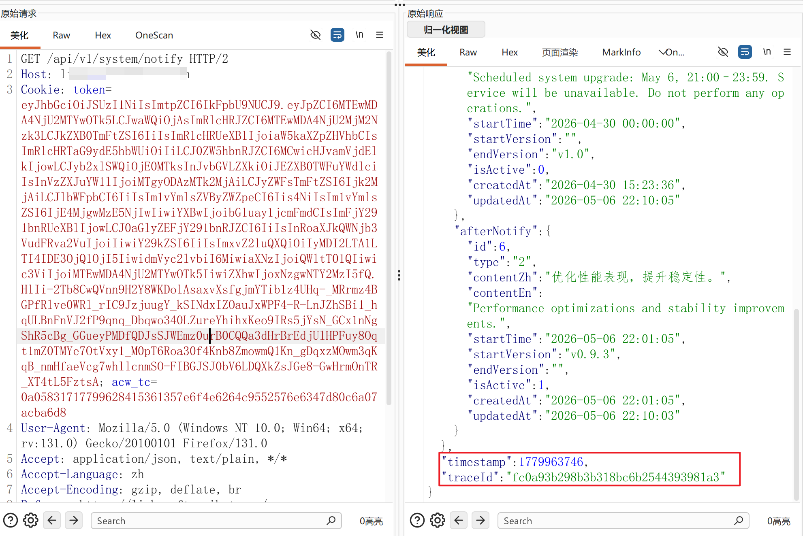
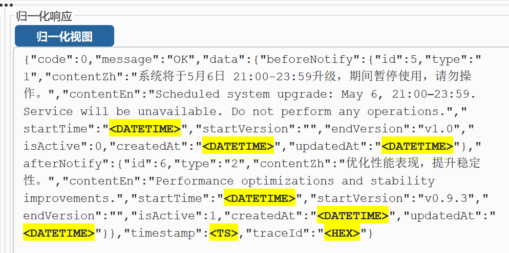

# YuSQL - Burp Suite SQL Injection Assistant Plugin

基于 Burp Montoya API 开发的 SQL 注入辅助测试插件（中文界面）。

## 设计理念与定位

### 与同类 SQL 注入插件的差异

**1. 面向 WAF/安全设备拦截严格场景及 SRC 漏洞挖掘设计**

POC 均来自护网、红队、企业 SRC 项目实战总结。第一设计原则就是**不能被安全设备拦截**——payload 精心构造，不包含 `select`、`union`、`sleep` 等高危特征关键字，避免触发 WAF 规则。

**2. 低漏报 + 低误报**

保证布尔注入、报错注入、排序注入漏报率低的同时，**大幅降低误报**。相较于 xiasql 及其他二开插件，YuSQL 不会仅因参数类型差异（如数值型/字符串型）就产生大量误报，每个注入判定都经过多步正交验证。

**3. POC 短小精悍，覆盖充分**

POC 数量少且 payload 短，用最少的测试请求覆盖最多的注入类型，减少请求量、降低被安全设备累积拦截的风险。

**4. 已知局限**

- 无数据回显且不报错的布尔盲注场景，目前尚无可靠的检测思路
- 时间盲注暂未内置通用过 WAF 的检查方案，请根据目标数据库特征自行构造 POC

## 版本

**v2.1.4** | 2026-05-06

> **v2.1.4 更新**: JSON-in-param 内部字段支持排序注入测试；修复首次运行时配置文件默认值未加载的 Bug；UI 按钮优化（保存/重新加载合并，新增打开配置文件按钮，删除追加按钮，"报错POC"更名为"自定义POC"）
>
> **v2.1.3 更新**: 新增原始请求中存在配置参数时单独排序注入测试；排序注入 R1 追加 `_aaa` 后缀；追加参数改为 upsert（替换已有而非追加）；删除"仅扫描Scope内"配置项；UI 优化（版本号、描述文本）
>
> **v2.1.2 更新**: 合并 SQL_diy_error.ini 补充报错正则匹配模式（102条），Unicode 转义改为原生中文，插件直接支持中文正则
>
> **v2.1.1 修复**: 修复 `PatternSyntaxException` 正则语法错误（字符类非法范围 + URL 黑名单 glob 通配符）

## 功能模块

| 模块 | 说明 |
|------|------|
| 布尔注入 | 引号奇偶性判别，3 步短路流程（R1→R3→R2），核心判定 R1≠R0 && R1==R3 && R2≠R1 |
| 报错注入 | 用户自定义 POC（默认 `\`），使用 SQL 报错正则匹配响应 |
| 追加参数测试 | 可分组追加参数，检测响应变化，支持重复 key 去重/溢出 |
| 排序注入 | 6 步流程检测 ORDER BY 注入（常规命中 / 逗号过滤兜底），响应体归一化对比 |

## 功能教程

### 归一化

扫描目标的时候，会出现这种每次请求不一样的字符，会影响页面变化的判断，会使用正则统一替换掉



点击“归一化视图”可查看替换了哪些内容




## 布尔注入流程

通过不同数量单引号（奇偶性）触发 SQL 语法差异来判定盲注：

```
          发送 R1(') ─── R1==R0(无变化) ──→ 跳过（不存在注入）
               │
          R1≠R0（有变化）
               │
               ▼
          发送 R3(''') ── R3≠R1 ──→ 跳过（奇偶不一致，非布尔注入）
               │
          R3==R1（同奇偶引号响应一致）
               │
               ▼
          发送 R2('') ── R2==R1 ──→ 跳过（偶数引号无差异，非布尔注入）
               │
          R2≠R1（偶数引号响应不同）
               │
               ▼
          ★ 布尔注入成立
```

### 判定原理

| 引号数量 | 拼接到 SQL 中的效果 | 预期 |
|---------|-------------------|------|
| `'` (1个，R1) | `WHERE id='1''` → 奇数引号，语法错误 | 与 R0 不同 |
| `'''` (3个，R3) | `WHERE id='1''''` → 奇数引号，语法错误 | 与 R1 相同 |
| `''` (2个，R2) | `WHERE id='1'''` → 偶数引号，语法闭合 | 与 R1/R3 不同 |

### 案例

```
GET /api/user?id=1

注入点：id 参数（数值型拼接到 SQL）

R0 (原始请求)： 200 OK  body="{"name":"admin"}"
R1 (id=1')：    500     body="You have an error in your SQL syntax near ''' ..."
  → R1≠R0，继续测试

R3 (id=1''')：  500     body="You have an error in your SQL syntax near ''''' ..."
  → R3==R1（同为奇数引号报错），继续测试

R2 (id=1'')：   200 OK  body="{"name":"admin"}"
  → R2≠R1（偶数引号闭合后恢复正常）
  → ★ 布尔注入成立！id 参数存在 SQL 注入
```

## 排序注入流程

向请求中追加排序参数，逐步替换参数值，通过响应体归一化对比检测 ORDER BY 注入点。

> **R1 设计思路**：R1 在配置的原始值后追加 `_aaa` 后缀（如 `orderBy_aaa`），目的是故意传一个**不存在的排序列**。因为该列不存在，SQL 会报错或返回异常响应，确保 R1≠R0。后续 R2 传 `1` 是因为表中第 1 列肯定存在、不会报错，让 R2≠R1，从而确认排序参数确实被后端解析执行。

```
R0(原始请求)  vs  R1(附加_aaa后缀)
       │               │
       └── R0==R1 ──→ 跳过
              │
         R0≠R1（列不存在，报错/异常）
              │
              ▼
R2(→1)  vs  R1 ── R2==R1 ──→ 跳过（1值不生效）
              │
         R2≠R1（排序生效）
              │
              ▼
R3(→1,aaa)  vs  R2 ── R3==R2 ──→ 跳过（逗号参数不生效）
              │
         R3≠R2（逗号生效）
              │
              ▼
R4(→1,CURRENT_TIMESTAMP)  vs  R2
       │                 │
       │    R4==R2 ─────→ ★ 常规命中
       │
  R4≠R2 ──→ 检查 R4 vs R3
              │
         R4≠R3 ──→ 跳过（均不相等，不存在注入）
         R4==R3 ──→ 疑似逗号过滤，进入兜底
              │
              ▼
         R5(→CURRENT_TIMESTAMP)  vs  R2
              │
         R5≠R2 ──→ 跳过
         R5==R2 ──→ 继续
              │
              ▼
         R6(→aaa)  vs  R2 且  vs  R5
              │
         R6≠R2 且 R6≠R5 ──→ ★ 逗号过滤兜底命中
         否则 ──→ 跳过（aaa 反证不通过）
```

### 各步骤含义

| 步骤 | 参数值 | 作用 |
|------|--------|------|
| R1 | 原始值 + `_aaa` 后缀 | 追加不存在的排序列（如 `orderBy_aaa`），让 SQL 报错或响应异常，确保 R1≠R0 |
| R2 | `1` | 替换为数值 1，第 1 列肯定存在不会报错，让 R2≠R1，确认排序值变化影响响应 |
| R3 | `1,aaa` | 含逗号的值，没有 `aaa` 这一列会继续报错/异常，让 R3≠R2 |
| R4 | `1,CURRENT_TIMESTAMP` | 含时间函数，数据库都支持 `CURRENT_TIMESTAMP` 常量，若响应同 R2 → 函数执行成功 |
| R5 | `CURRENT_TIMESTAMP` | 单值时间函数（逗号过滤兜底），去除逗号因素，若同 R2 → 函数值单独生效 |
| R6 | `aaa` | 反证：随机字符串，确保 R5 不是碰巧一致（R6 必须 ≠R2 且 ≠R5） |

### 案例

```
GET /shop/list?cat=1

追加参数：orderBy=orderBy（归入排序测试）
说明：原始请求无排序参数，追加 orderBy 后因列名不匹配触发 SQL 报错。

R0 (原始请求)：                  body="苹果,香蕉,橘子"        （默认顺序）
R1 (orderBy=orderBy_aaa)：       body="ERROR: Unknown column 'orderBy_aaa'" （列不存在）
  → R1≠R0（附加不存在的排序列后报错），继续测试

R2 (orderBy=1)：                body="橘子,苹果,香蕉"        （按第1列排序）
  → R2≠R1，排序值变化确实影响响应

R3 (orderBy=1,aaa)：            body="橘子,苹果,香蕉"
  → R3≠R2（1,aaa 语法不同但效果等价），逗号参数生效

R4 (orderBy=1,CURRENT_TIMESTAMP)：body="橘子,苹果,香蕉"
  → R4==R2，CURRENT_TIMESTAMP 被解析为常量，与 1 同效
  → ★ 排序注入成立！（常规命中）
```

**逗号过滤兜底场景：**

当服务器对逗号做过滤处理时，`1,aaa` 和 `1,CURRENT_TIMESTAMP` 都会因包含逗号而触发相同结果——可能是逗号被直接移除（变成 `1aaa` / `1CURRENT_TIMESTAMP`），也可能是检测到逗号即报错"非法字符"。这导致 R4==R3，无法通过常规路径判定。

兜底策略：去掉逗号，仅传 `CURRENT_TIMESTAMP` 单值，避免逗号过滤干扰：

```
R4 (orderBy=1,CURRENT_TIMESTAMP)：body="ERROR: 非法字符"
  → R4≠R2，但 R4==R3（两者都含逗号，触发同样的过滤报错）

R5 (orderBy=CURRENT_TIMESTAMP)：   body="橘子,苹果,香蕉"      （无逗号，正常）
  → R5==R2，函数值单独生效，说明逗号确实是卡点

R6 (orderBy=aaa)：                 body="ERROR: Unknown column 'aaa'"
  → R6≠R2 且 R6≠R5，排除"任意值都返回同结果"的误判
  → ★ 排序注入成立！（逗号过滤兜底）
```

### 归一化说明

每一步对比前都会从响应体中移除参数名和参数值，再进行标准化（去除空白、时间戳等动态内容），确保判定不受参数值字面量影响。

## 参数支持

| 参数类型 | 说明 | 示例 |
|---------|------|------|
| GET 查询参数 | URL `?` 后的 key=value | `?id=1&name=test` |
| POST form 参数 | `application/x-www-form-urlencoded` body | `id=1&name=test` |
| JSON body | `application/json` body 中的字段值 | `{"id":1,"name":"test"}` |
| JSON in param | GET/POST form 参数值为 JSON 时，自动解析内部字段 | `?data={"id":1}` → 测试 `$.id` |

### JSON in param 自动解析

当 GET 查询参数或 POST form 参数的值是合法 JSON（以 `{`/`[` 开头并以 `}`/`]` 结尾）时，插件会自动将 JSON 内部的字段值作为独立测试点：

```
原始请求：
  GET /api/query?filter={"name":"admin","page":1}

解析出 2 个测试点：
  $.name → admin
  $.page → 1

注入测试时：
  $.name → admin'  （payload 注入到 JSON 字符串内部）
  $.page → 1'
```

**注意：**
- 插件会先 URL 解码参数值，再判断是否为 JSON
- 支持嵌套 JSON 对象和数组
- JSON 值注入时会保持外层 JSON 结构完整

## 构建

**前置要求：** JDK 17+

### Windows

```bat
set JAVA_HOME=C:\Program Files\Java\jdk-17
mvn clean package
```

### macOS / Linux

```bash
export JAVA_HOME=/path/to/jdk-17
mvn clean package
```

输出：`target/yusql-2.1.4.jar`

## 开发指南

### 环境要求

| 依赖 | 版本 | 说明 |
|------|------|------|
| JDK | 17+ | 编译和运行均需 JDK 17 |
| Maven | 3.9+ | 或使用项目自带的 Maven Wrapper（无需安装） |
| Burp Suite | 2024+ | Montoya API 2026.4 |

### 环境变量

**Windows (CMD):**
```bat
set JAVA_HOME=C:\Program Files\Java\jdk-17
set PATH=%JAVA_HOME%\bin;%PATH%
```

**Windows (PowerShell):**
```powershell
$env:JAVA_HOME = "C:\Program Files\Java\jdk-17"
$env:PATH = "$env:JAVA_HOME\bin;$env:PATH"
```

**macOS / Linux (bash/zsh):**
```bash
export JAVA_HOME=/path/to/jdk-17
export PATH=$JAVA_HOME/bin:$PATH
```

验证环境：
```bash
java -version    # 应显示 17.x
mvn -version     # 如未安装 Maven，使用 mvnw 命令
```

### 编译打包

#### 方式一：Maven Wrapper（推荐，无需安装 Maven）

**Windows:**
```bat
cd /path/to/yusql
set JAVA_HOME=C:\Program Files\Java\jdk-17
mvnw.cmd clean package -DskipTests
```

**macOS / Linux:**
```bash
cd /path/to/yusql
export JAVA_HOME=/path/to/jdk-17
java -Dmaven.multiModuleProjectDirectory="$PWD" \
     -classpath ".mvn/wrapper/maven-wrapper.jar" \
     org.apache.maven.wrapper.MavenWrapperMain \
     clean package -DskipTests
```

#### 方式二：已安装 Maven

```bash
cd /path/to/yusql
mvn clean package -DskipTests
```

#### 仅编译（不打包）

```bash
mvn compile
# 或使用 Wrapper：
java -Dmaven.multiModuleProjectDirectory="$PWD" \
     -classpath ".mvn/wrapper/maven-wrapper.jar" \
     org.apache.maven.wrapper.MavenWrapperMain compile
```

### 项目结构

```
yusql/
├── pom.xml                                          # Maven 项目配置
├── mvnw.cmd                                         # Maven Wrapper (Windows)
├── .mvn/wrapper/
│   ├── maven-wrapper.jar                            # Maven Wrapper JAR
│   └── maven-wrapper.properties                     # Maven 版本配置
└── src/
    ├── main/java/com/yusql/
    │   ├── YuSQLExtension.java                      # 插件入口
    │   ├── config/
    │   │   └── YuSQLConfig.java                     # 配置管理（加载/保存/默认值）
    │   ├── compare/
    │   │   ├── Normalizer.java                      # 响应归一化
    │   │   ├── ResponseComparator.java              # 响应对比
    │   │   ├── ResponseFingerprint.java             # 响应指纹
    │   │   └── TextSimilarity.java                  # 文本相似度
    │   ├── engine/
    │   │   ├── ScanEngine.java                      # 扫描引擎（调度入口）
    │   │   ├── ScanTask.java                        # 扫描任务
    │   │   ├── TaskQueue.java                       # 任务队列
    │   │   └── DedupCache.java                      # 去重缓存
    │   ├── filter/
    │   │   └── FilterManager.java                   # URL/域名/参数过滤器
    │   ├── model/
    │   │   ├── TestPoint.java                       # 测试点模型
    │   │   ├── LogEntry.java                        # 日志条目
    │   │   ├── ScanState.java                       # 扫描状态
    │   │   ├── ParamType.java                       # 参数类型枚举
    │   │   ├── JsonTestType.java                    # JSON 测试类型
    │   │   ├── ModuleType.java                      # 模块类型
    │   │   └── RiskLevel.java                       # 风险等级
    │   ├── module/
    │   │   ├── BooleanBlindModule.java              # 布尔注入（3步短路）
    │   │   ├── ErrorInjectionModule.java            # 报错注入
    │   │   ├── OrderTestModule.java                 # 追加参数测试
    │   │   └── OrderInjectionModule.java            # 排序注入（6步流程）
    │   ├── monitor/
    │   │   ├── MonitorHandler.java                  # Repeater 监控
    │   │   └── ProxyMonitorHandler.java             # Proxy 监控
    │   ├── mutate/
    │   │   └── RequestBuilder.java                  # 请求构造（payload 注入）
    │   ├── parser/
    │   │   ├── ParameterParser.java                 # 参数解析（GET/POST/JSON）
    │   │   ├── JsonInParamParser.java               # JSON-in-param 解析
    │   │   └── SimpleJson.java                      # 简易 JSON 解析器
    │   └── ui/
    │       ├── YuSQLTab.java                        # 主界面（表格/编辑器/配置）
    │       └── ContextMenuProvider.java             # 右键菜单
    └── main/resources/META-INF/services/
        └── burp.api.montoya.BurpExtension           # Burp SPI 注册

yusql-release/                                       # 发布目录（GitHub Release）
├── README.md
├── .gitignore
└── yusql-X.Y.Z.jar                                  # 编译产物
```

### Burp 加载插件

1. Burp Suite → Extensions → Add
2. Extension Type: Java
3. 选择 `yusql-2.1.4.jar`
4. 插件启动后会在 `~/.yusql/` 生成默认配置文件

### 调试

- 在 Burp Extensions 窗口选择 YuSQL 查看 Output 和 Errors
- 插件运行日志在右侧"日志"Tab 中查看
- 配置文件在 `~/.yusql/` 目录，可直接编辑后点击"保存并重新加载"

## Burp 加载

1. Burp Suite → Extensions → Add
2. Extension Type: Java
3. 选择 `yusql-2.1.4.jar`

## 配置目录

```
~/.yusql/
├── SQL_settings.ini              # 主配置
├── SQL_diy_error.ini             # SQL 报错正则（103 条默认规则）
├── SQL_append_params.ini         # 追加参数（113 条默认，含 JSON 值示例）
├── SQL_append_params_groups.ini  # 追加参数分组
├── SQL_order_injection_params.ini# 排序注入测试参数（默认全选）
├── SQL_error_pocs.ini            # 报错注入 POC
├── SQL_noise_regex.ini           # 响应去噪正则
├── SQL_param_blacklist.ini       # 参数黑名单
├── SQL_url_blacklist.ini         # URL 黑名单（123 条默认规则）
├── SQL_domain_blacklist.ini      # 域名黑名单
├── SQL_domain_whitelist.ini      # 域名白名单
└── SQL_param_whitelist.ini       # 参数白名单
```

## 使用方式

- **右键菜单**：发送到 YuSQL / 强制重新扫描
- **监控模式**：可开启 Proxy / Repeater 自动扫描
- **过滤规则**：域名黑名单 > 域名白名单 > URL 黑名单 > 参数黑名单 > 参数白名单

## 技术栈

- Java 17
- Burp Montoya API 2026.4
- Maven 3.9+

## 开发团队

- **团队**: FUZZ Team
- **公众号**: FUZZ Team
- **成员**: ink、Herbert555